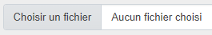

# Installation locale du projet

## Sommaire
- [Copie du projet GitHub](#copie-du-projet-github)
- [Installation de la base de données](#installation-de-la-base-de-données)
- [Exécution du programme](#exécution-du-programme)
- [Ajout d'un compte administrateur](#ajout-dun-compte-administrateur)
- [Informations complémentaires](#informations-complémentaires)

## Copie du projet GitHub
##### Pour une installation locale, il faut utiliser un logiciel qui exécute un serveur Apache comme Wamp64 ou Xampp.
##### Pour récupérer le code du projet, il suffit d'installer Git sur son poste puis de saisir la commande suivante :
```bash
git clone https://github.com/Romain-Leblanc/ecf-quai-antique
```

## Installation de la base de données
##### Pour importer la base de données, il faut importer le fichier "romain-leblanc-quai-antique-symfony.sql" à la racine du projet soit avec une interface graphique comme PHPMyAdmin ou en ligne de commandes MySQL.
### Installation avec PHPMyAdmin
##### Il faut d'abord s'y connecter, cliquez sur le bouton "Importer" dans le menu du haut, sélectionner le fichier avec le bouton "Choisir un fichier" et valider l'importation avec le bouton "Importer" tout en bas de la page courante :
###### Image du bouton "Importer" du menu

###### Image du bouton "Choisir un fichier"

###### Image du bouton "Importer" pour valider l'importation

### Installation avec le terminal
##### Il faut se rendre dans le terminal, accéder à l'emplacement du dossier MySQL puis s'y connecter. Veuillez remplacer '<votre_version_mysql>' par le nom de votre version exacte.
###### Emplacement très courant de ce dossier
```
cd C:\wamp64\bin\mysql\<votre_version_mysql>\bin
```
##### Pour exécuter ce fichier en ligne de commande MySQL, il faut se rendre dans le terminal et se connecter à MySQL :
```shell
mysql -u root -p
```
##### Il faut y saisir le mot de passe MySQL ou appuyer sur la touche "Entrée" s'il n'y en a pas.
##### Une fois connecté à MySQL, il suffit d'entrer la commande suivante (on suppose que le dossier du projet se situe dans "C:/wamp64/www")
```shell
SOURCE C:/wamp64/www/ecf-quai-antique/romain-leblanc-quai_antique_symfony.sql;
```
##### Pour finir et se déconnecter de MySQL, il suffit d'exécuter la commande suivante :
```shell
exit;
```

## Exécution du programme
##### Pour l'exécuter, il suffit de se rendre dans le dossier du projet puis installer Composer et NPM à l'aide des 2 commandes suivantes :
###### Installation de Composer
```bash
composer install
```
###### Installation de NPM
```bash
npm install
```

##### En cas de besoin de modification d'accès à la base de données, il peut être nécessaire de modifier le fichier ".ENV" à la racine et notamment la ligne "DATABASE_URL" :
###### Extrait du fichier .ENV
```bash
DATABASE_URL="mysql://root@127.0.0.1:3306/quai_antique_symfony"
```

##### Une fois le paramétrage terminé, il suffit de démarrer le serveur Symfony et NPM dans cet ordre-là avec les 2 commandes suivantes :
###### Démarrage du serveur Symfony
```bash
symfony server:start -d
```
###### Démarrage du serveur NPM
```bash
npm run watch
```

##### Pour arrêter l'exécution du projet, il suffit d'appuyer sur la touche "CTRL+C".
##### Il se peut que le serveur Symfony ne se soit pas arrêter avec la touche du clavier précédente, il faut par conséquent insérer la commande suivante :
```bash
symfony server:stop
```

## Ajout d'un compte administrateur
##### Pour commencer, il faut accéder à l'interface d'administration avec un compte administrateur.
##### Ensuite, pour se connecter, il faut se rendre au formulaire de connexion accessible par le menu principal de l'application avec le bouton "Se connecter" et y saisir les informations ci-dessous.
###### Image du bouton de connexion

###### Image du formulaire de connexion

###### Informations de connexion du compte administrateur
- [Cliquez ici pour voir ces informations](#informations-de-connexion-du-compte-administrateur)
##### Après s'être connecté, vous serez redirigé vers cette interface avec la liste des réservations.
##### Ensuite, il faudra vous rendre à la liste des administrateurs accessible par le menu principal puis cliquer sur le bouton "Ajouter".
###### Image du menu principal de l'interface

###### Image du bouton "Ajouter"

##### Pour terminer, il faudra renseigner une adresse mail, un mot de passe, un nom et un prénom pour le nouveau compte administrateur.
:warning: Si l'adresse mail saisie existe déjà pour un compte administrateur ou utilisateur, cela génèrera une erreur. :warning:
## Informations complémentaires
###### Informations de connexion du compte administrateur
> Email : admin@quai-antique.fr<br>
> Mot de passe : Admin123!
###### Informations de connexion du compte utilisateur
> Email : romleb2001@gmail.com<br>
> Mot de passe : Dupont123!